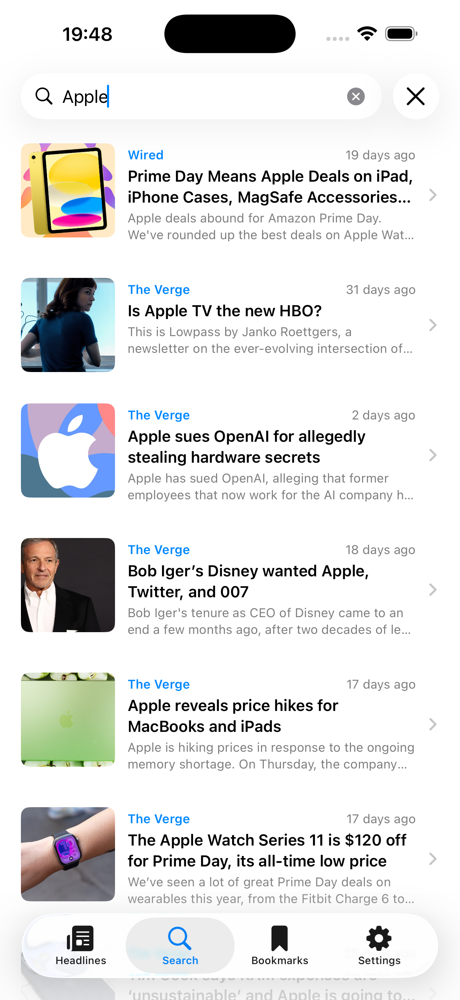
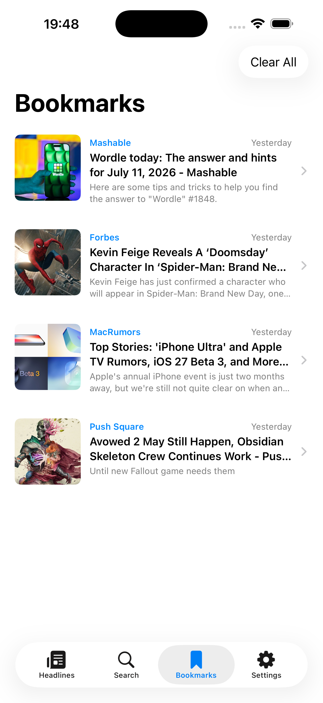
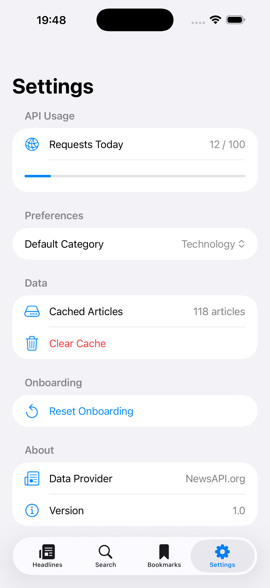
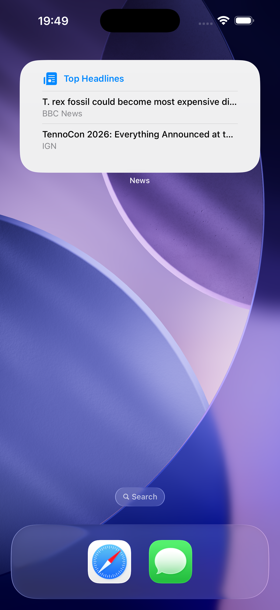

# NewsFlow

An iOS news reader built with SwiftUI, demonstrating protocol-oriented networking, offline-first caching, and testable MVVM architecture.


---

## Screenshots

| Headlines | Article Detail | Search |
|-----------|---------------|--------|
|  |  |  |

| Bookmarks | Settings | Widget |
|-----------|----------|--------|
|  |  |  |

---

## Overview

NewsFlow is an iOS app that delivers personalised top headlines across multiple categories. Built as a portfolio project to demonstrate production-grade iOS architecture, networking patterns, and engineering decision-making.

- 📰 Top headlines across 6 categories
- 🔍 Full-text search with debounced queries
- 🔖 Offline bookmark saving
- 📵 Offline mode with cached content
- 🔄 Pull to refresh with auto-reconnection
- 🏠 Home screen WidgetKit extension
- ⚙️ Settings with API usage tracking
- 🎯 Personalised onboarding

---

## Architecture

NewsFlow follows **MVVM** with a clean separation between networking, caching, and presentation layers. Organised using a feature-based folder structure.
Every ViewModel receives a `NewsServiceProtocol` via dependency injection — enabling development and testing against `MockNewsService` without real API calls.

### Key Architectural Decisions

**Protocol-Oriented Service Layer**
`NewsServiceProtocol` defines the contract for all data fetching. `LiveNewsService` conforms for production and `MockNewsService` conforms for development — ViewModels never know which one they're talking to. This enabled all UI development without consuming real API quota.

**Generic ViewState Enum**
Rather than managing multiple boolean flags (`isLoading`, `hasError`, `isEmpty`), every ViewModel uses a single generic `ViewState<T>` enum with cases for `idle`, `loading`, `success`, `empty`, and `failure`. Only one state is ever possible at a time — the compiler enforces it.

**Dependency Injection Throughout**
Every ViewModel receives its dependencies via initialiser with production defaults:
```swift
init(
    service: NewsServiceProtocol = LiveNewsService(),
    cache: CacheManager = .shared,
    monitor: NetworkMonitor = .shared
)
```
This makes every ViewModel fully testable by injecting mocks without modifying production code.

**SwiftData for Persistence**
Two separate SwiftData models — `CachedArticle` for time-limited API response caching and `BookmarkedArticle` for permanent user saves. Keeping them separate means cache clearance never affects bookmarks.

---

## Networking & Caching

### Rate Limit Strategy
NewsAPI enforces a 100 request/day limit on the free tier. NewsFlow handles this through:

- **Cache-first loading** — SwiftData cache checked before every network call
- **30 minute TTL** — balances content freshness with API quota preservation  
- **Two-tier image cache** — NSCache (memory) + FileManager (disk) eliminates redundant image downloads
- **Request counter** — daily usage tracked in Settings, resets at midnight
- **MockNewsService** — all UI development done against mock data, preserving real API budget

### Retry & Resilience
- Exponential backoff retry (1s → 2s → 4s) for transient network failures
- Only retryable errors trigger retry — rate limit and decoding failures fail immediately
- `NWPathMonitor` detects connectivity changes in real time
- Content auto-refreshes when connection restores

### Offline Mode
When offline, NewsFlow gracefully degrades:
- Cached articles served automatically with offline banner
- Search disabled with clear messaging  
- Bookmarks fully available — local SwiftData, zero network dependency

---

## Tech Stack

| Technology | Usage |
|------------|-------|
| SwiftUI | All UI, reactive state management |
| SwiftData | Article caching, bookmark persistence |
| async/await | All networking and concurrent operations |
| WidgetKit | Home screen headline widget |
| NWPathMonitor | Real-time connectivity monitoring |
| NSCache + FileManager | Two-tier image caching |
| AppStorage | User preferences and settings |
| NewsAPI | News data source |

---

## Development Process

Built across 16 feature branches with individual PRs merged into main — following professional Git workflow throughout.

| Branch | Purpose | Key Engineering Decision |
|--------|---------|--------------------------|
| `chore/project-setup` | Folder structure, config, gitignore | Feature-based over layer-based architecture |
| `feature/networking-layer` | Generic async client, protocol service | Protocol + DI enables mock testing without API calls |
| `feature/caching-layer` | SwiftData persistence with TTL | 30min TTL balances freshness vs API quota |
| `feature/network-monitor` | NWPathMonitor connectivity | @Observable for reactive UI updates |
| `feature/viewstate-and-base` | Generic ViewState enum, shared components | Single state enum replaces multiple boolean flags |
| `feature/headlines` | Headlines feed with pagination | Cache-first loading, parallel category prefetch |
| `feature/article-detail` | Article detail, bookmarking | URL as stable unique identifier for bookmarks |
| `feature/search` | Full-text search with debounce | 300ms debounce reduces API calls significantly |
| `feature/bookmarks-and-navigation` | Bookmarks + tab navigation | @Query for automatic SwiftData UI sync |
| `feature/offline-mode` | Offline graceful degradation | Cache checked before connectivity guard |
| `feature/settings` | API usage, preferences, cache management | @AppStorage for reactive settings binding |
| `feature/onboarding` | 3-slide onboarding, category selection | Set<String> prevents duplicate category selection |
| `feature/widget` | WidgetKit home screen widget | Separate URLSession — widgets run in isolated process |
| `feature/image-caching` | NSCache + disk image cache | Two-tier cache eliminates redundant image downloads |
| `feature/retry-and-resilience` | Exponential backoff retry | Only retryable errors trigger retry |
| `chore/accessibility` | VoiceOver, Dynamic Type support | .combine accessibility element for article cards |

---

## Setup

1. Clone the repository
2. Copy `Config.example.swift` to `Config.swift`
3. Add your API key from [newsapi.org](https://newsapi.org)
4. Add App Group capability: `group.<your-bundle-id>`
5. Build and run on iOS 26+

---

## Requirements

- iOS 26.0+
- Xcode 26+
- Free [NewsAPI](https://newsapi.org) key

---

## Roadmap

- Unit test coverage for ViewModels and CacheManager
- Background refresh using BGAppRefreshTask
- Offline search using local index
- Haptic feedback on bookmark interactions
- iPad optimised layout

---

## Data Source

News data provided by [NewsAPI.org](https://newsapi.org)

---

## Author

Parth Patel - [GitHub](https://github.com/parth49patel) · [Medium](https://medium.com/@4parth9)
